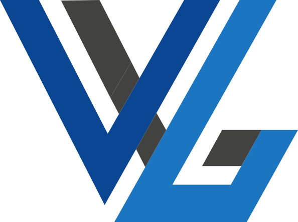
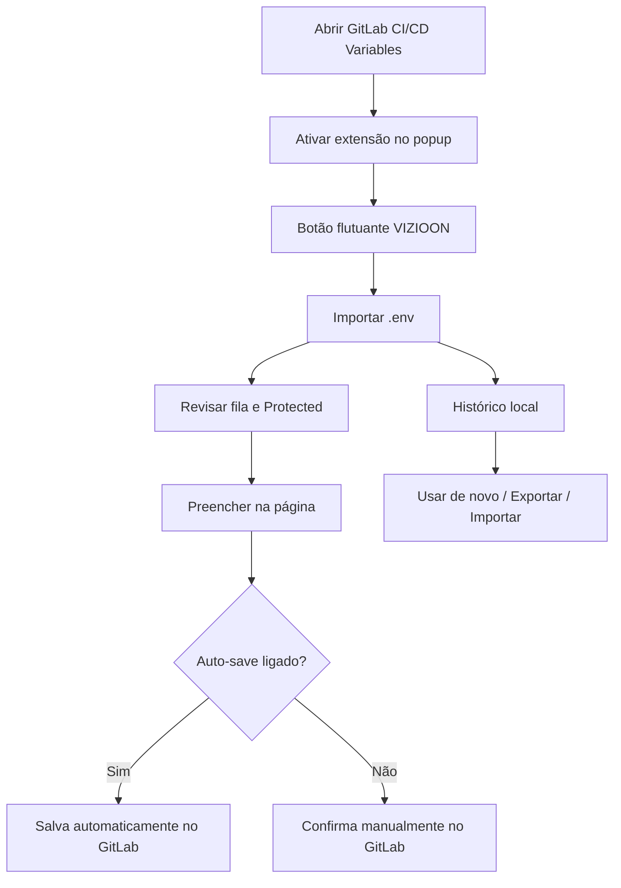

<p align="center">
  
</p>

<h1 align="center">VIZIOON LAB ENVIRONMENTS</h1>

<p align="center">
  Extensão para <strong>Chrome</strong> e <strong>Edge</strong> que importa variáveis de ambiente (<code>.env</code>)<br />
  direto na página <strong>CI/CD → Variables</strong> do GitLab.
</p>

<p align="center">
  
  
  
  <br />
  
  
  
  <br />
  
  
</p>

---

## Documentação

<p align="center">
  <a href="https://dvizioon.github.io/VIZIOON-LABENVIRONMENTS/docs/intro">
    
  </a>
</p>

- [Introdução](https://dvizioon.github.io/VIZIOON-LABENVIRONMENTS/docs/intro)
- [Instalação](https://dvizioon.github.io/VIZIOON-LABENVIRONMENTS/docs/instalacao)
- [Navegadores](https://dvizioon.github.io/VIZIOON-LABENVIRONMENTS/docs/navegadores)
- [Guia de variáveis](https://dvizioon.github.io/VIZIOON-LABENVIRONMENTS/docs/guia/variaveis)
- [Versões](https://dvizioon.github.io/VIZIOON-LABENVIRONMENTS/docs/versoes)
- [Privacidade](https://dvizioon.github.io/VIZIOON-LABENVIRONMENTS/docs/privacidade)

---

## Funcionalidades

- **Importar .env:** Arraste o arquivo, selecione no disco ou cole o conteúdo no campo de texto.
- **Fila de variáveis:** Revise chave, valor e checkbox **Protected** antes de enviar ao GitLab.
- **Preencher na página:** Cadastra cada variável da fila automaticamente na tela de Variables.
- **Abas de ambiente:** Separe Padrão, produção, homologação e outros com prefixo nas chaves.
- **Histórico local:** Exporte, importe e reutilize importações anteriores com o botão **Usar**.
- **Auto-save:** Salva cada variável no GitLab automaticamente ao preencher (configurável).
- **Botão flutuante:** Liga ou desliga o botão VIZIOON nas páginas do GitLab pelo popup.
- **Privacidade:** Aviso na primeira ativação; dados ficam só no seu navegador.

## Tecnologias Utilizadas

- **Vue 3:** Interface da extensão (popup, barra lateral e content script).
- **TypeScript:** Tipagem em toda a base da extensão e do site de documentação.
- **Vite + CRXJS:** Build da extensão Chrome Manifest V3.
- **Pinia:** Estado global (configurações, abas, histórico, fila de importação).
- **Tailwind CSS:** Estilos da extensão.
- **Iconify (Phosphor):** Ícones no plugin e na documentação.
- **Docusaurus:** Site de documentação publicado no GitHub Pages.
- **Chrome Storage API:** Persistência local de preferências e histórico.

> [!IMPORTANT]
> A extensão **não envia** seus dados para servidores da VIZIOON. Tudo roda no navegador e no GitLab que você já usa.

> [!NOTE]
> Prints e guia passo a passo estão na [documentação](https://dvizioon.github.io/VIZIOON-LABENVIRONMENTS/docs/intro).

> [!CAUTION]
> Variáveis sensíveis do `.env` passam pela interface da extensão e pelo formulário do GitLab. Use apenas em ambientes e máquinas em que você confia.

## Navegadores compatíveis

| Navegador | Status |
|-----------|--------|
| Google Chrome | Compatível |
| Microsoft Edge | Compatível |
| Brave / Opera / Arc | Compatível |
| Firefox / Safari | Não compatível |

## Fluxo de uso



## Estrutura do Projeto

```bash
VIZIOON-LABENVIRONMENTS/
│
├── src/
│   ├── background/          # Service worker
│   ├── content/             # Botão flutuante e injeção no GitLab
│   ├── popup/               # Popup da extensão (toggle)
│   ├── sidepanel/           # Barra lateral principal
│   ├── views/               # Variáveis, Histórico, Config, Sobre, Versões
│   ├── stores/              # Pinia (settings, tabs, history, import)
│   ├── composables/         # GitLab DOM, fila, releases, toast
│   ├── components/          # UI compartilhada
│   └── core/constants.ts    # Nome, versão, URLs
│
├── website/                 # Documentação (Docusaurus)
│   ├── docs/                # Páginas em Markdown
│   ├── src/components/      # Intro, Versões, Navegadores, Sobre
│   └── static/img/          # Logo e screenshots
│
├── public/                  # Ícones da extensão
├── manifest.config.ts       # Manifest Chrome MV3
├── vite.config.ts
├── RELEASES.txt             # Notas para publicar release no GitHub
└── README.md
```

## Instalação

### Usuário final (release)

1. **Baixe a release** em [GitHub Releases](https://github.com/dvizioon/VIZIOON-LABENVIRONMENTS/releases).
2. **Extraia** o conteúdo do zip.
3. Abra `chrome://extensions` (Chrome) ou `edge://extensions` (Edge).
4. Ative **Modo do desenvolvedor**.
5. **Carregar sem compactação** → selecione a pasta extraída.

### Desenvolvimento local

1. **Clone o repositório:**

   ```bash
   git clone https://github.com/dvizioon/VIZIOON-LABENVIRONMENTS
   cd VIZIOON-LABENVIRONMENTS
   ```

2. **Instale e gere o build da extensão:**

   ```bash
   npm install
   npm run build
   ```

3. Carregue a pasta `dist` em `chrome://extensions` (modo desenvolvedor).

4. **Documentação local (opcional):**

   ```bash
   cd website
   npm install
   npm start
   ```

   Site em `http://localhost:3000/VIZIOON-LABENVIRONMENTS/`

## Scripts

| Comando | Descrição |
|---------|-----------|
| `npm run dev` | Extensão em modo desenvolvimento (Vite) |
| `npm run build` | Build de produção → pasta `dist` |
| `cd website && npm start` | Documentação local |
| `cd website && npm run build` | Build do site para GitHub Pages |

## Contato

Dúvidas: [danielmartinsjob@gmail.com](mailto:danielmartinsjob@gmail.com)

## Licença


